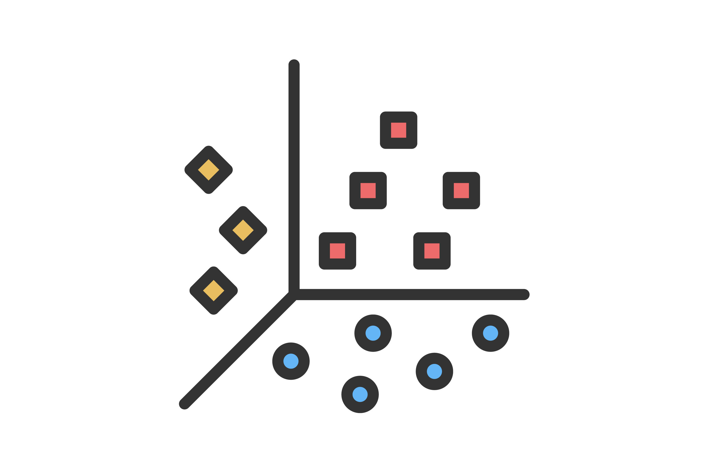
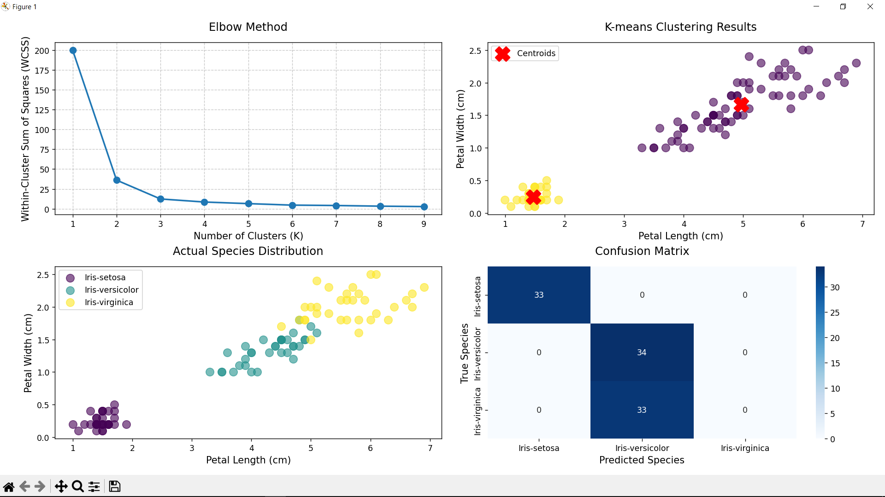

<!-- Intro-->

<!--
* Thanks for reviewing my Project-README-Template! 
* Access the blank-template here (https://github.com/YousefIbrahimismail/Project-README-Template/blob/main/Templates/_blank-README.md) 
* 
* Read the comments for an easy step by step guide.or read this Make_it_Yours guide here: () // add Personalization_md_file
* Enjoy!
-->


<!-- Shields Section--><!-- Optional -->

<!-- 
* Insert project shields and badges through this link https://shields.io/
* 
*
-->

<div align="center">
    <a href="https://github.com/AJSahagun/CS-422_K-Means_Clustering/stargazers"></a>
    <a href="https://github.com/AJSahagun/CS-422_K-Means_Clustering/issues"></a>
    <a href="https://github.com/AJSahagun/CS-422_K-Means_Clustering/network"></a>
</div>
<br>


<!-- Logo Section  --><!-- Required -->

<!--
* Insert an image URL in the  "src" attribute bellow. (line )
* 
* Insert your github profile URL in the <a> "href" attribute bellow (line )
-->


<div align="center">
    <a href="https://github.com/AJSahagun/" target="_blank">
        
    </a>
</div>


<!-- Project title 
* use a dynamic typing-SvG here https://readme-typing-svg.demolab.com/demo/
*
*  Instead you can type your project name after a # header
-->

<div align="center">

</div>


## About<!-- Required -->
<!-- 
* information about the project 
* 
* keep it short and sweet
-->


This project demonstrates K-means clustering on the Iris dataset using petal length and width features. The implementation includes data preprocessing, model training, evaluation, and visualization of results. Key components:

- **Data Preprocessing**: Scales features and maps cluster labels to true species.
- **Model Training**: Uses the elbow method to determine optimal clusters (fixed at k=3 for Iris).
- **Visualization**: Generates plots for the elbow method, clustering results, true species distribution, and a confusion matrix.


## How to use this project<!-- Required -->
<!-- 
* Here you may add information about how 
* 
* and why to use this project.
-->

- Clone this repository into your local machine.

```bash
    git clone https://github.com/AJSahagun/CS-422_K-Means_Clustering.git
```

- Set up your environment
```bash
    pip install -r requirements.txt
```

- Run the main script:
```bash
    python main.py
```

## Demo<!-- Required -->
<!-- 
* You can add a demo here GH supports images/ GIFs/videos 
* 
* It's recommended to use GIFs as they are more dynamic
-->

### Version 1 - Features: Petal Length & Width (2D)


### Output

- Printed evaluation metrics (precision, recall, F1-score).
- A 2x2 visualization grid:
1. Elbow Method Plot 
2. K-means Clustering Results 
3. True Species Distribution 
4. Confusion Matrix

<div align="center">

[//]: # (    )
</div>

## Table of Contents<!-- Optional -->
<!-- 
* This section is optional, yet having a contents table 
* helps keeping your README readable and more professional.
* 
* If you are not familiar with HTML, no worries we all been there :) 
* Review learning resources to create anchor links. 
-->


<dev display="inline-table" vertical-align="middle">
<table align="center" vertical-align="middle">
        <tr>
            <td><a href="#about">About</a></td>        
            <td><a href="#how-to-use-this-project">Getting started</a></td>
            <td><a href="#demo">Demo</a></td>
            <td><a href="#project-roadmap--">Project Roadmap</a></td>
        </tr>
        <tr>
            <td><a href="#documentation">Documentation</a></td>
            <td><a href="#contributors">Contributors</a></td>
            <td><a href="#acknowledgments">Acknowledgments</a></td>
            <td><a href="#contact">Contact</a></td>
        </tr>
</table>
</dev>


<!-- - Use this html element to create a back to top button. -->
<p align="right"><a href="#how-to-use-this-project">back to top ⬆️</a></p>


## Project Roadmap <!-- Optional --> <!-- add learning_Rs-->
<!-- 
* Add this section in case the project has different phases
* 
* Under production or will be updated.
-->

- [x] Create Project Repository
- [x] Choose a dataset
- [x] Start ML Model development
- [x] Evaluate the Model's accuracy
- [x] Implement visualization
- [x] Implement Revisions


<p align="right"><a href="#how-to-use-this-project">back to top ⬆️</a></p>

## Documentation<!-- Optional -->
<!-- 
* You may add any documentation or Wikis here
* 
* 
-->
### Project Structure
```
CS-422_K-Means_Clustering/
│
├── data/
│   ├── Iris-Original.csv
│   └── ml_group-4_iris_dataset.csv
│
├── src/
│   ├── ver_1/                 # Features: Petal Length & Width (2D)
│   │   ├── preprocessing.py
│   │   └── visualization.py
│   ├── ver_2/                 # Features: Sepal Length & Width (2D)
│   │   ├── preprocessing.py
│   │   └── visualization.py
│   ├── ver_3/                 # Features: Petal Length & Width, Sepal Width (3D)
│   │   ├── preprocessing.py
│   │   └── visualization.py
│   ├── custom_kmeans.py       # KMeans model implementation
│   └── kmeans_model.py        # KMeans model from Sci-kit
│   
│
├── notebook/
│   └── kmeans.ipynb           # Jupyter notebook for the model
│
├── img/
│   ├── logo.jpg               # Picture logo used in Read me
│   └── output.png             # Demo picture used in Read me
│
├── requirements.txt           # Project dependencies
├── README.md                  # Project documentation
└── main.py                    # Main script to run the project
```

### Module Documentation

#### `main.py`
**Entry point for the application:**
1. Loads and preprocesses data 
2. Calculates WCSS for elbow method 
3. Trains model with optimal k=3 
4. Evaluates performance 
5. Generates composite visualization

#### `preprocessing.py`
**Data handling:**
- load_and_preprocess_data(file_path)
- Returns: (X_scaled, y, scaler)
  - Loads data 
  - Extracts petal features 
  - Scales features using StandardScaler
- create_label_mapping(true_labels, cluster_labels)
- Returns: Best label mapping dictionary 
  - Finds optimal cluster-to-species mapping using permutation accuracy tests

#### `custom_kmeans.py`
**Custom clustering implementation:**
- KMeans class: (Core algorithm with)
  - Random centroid initialization 
  - Iterative centroid updating 
  - Convergence checking 
  - WCSS calculation
- IrisKMeans wrapper class: (Methods)
  - fit(): Train model 
  - predict(): Get cluster labels 
  - evaluate(): Returns metrics dictionary with:
    - Confusion matrix 
    - Precision/Recall/F1-score

#### `visualization.py`
**Plotting functions:**
- plot_clustering_analysis(): (Generates 4-panel figure showing)
  1. Elbow method curve 
  2. Cluster assignments with centroids
  3. True species distribution
  4. Confusion matrix
- calculate_wcss():
  - Computes WCSS values for k=1 to max_k


## Contributors<!-- Required -->
<!-- 
* Without contribution we wouldn't have open source. 
* 
* Generate github contributors Image here https://contrib.rocks/preview?repo=angular%2Fangular-ja
-->

<a href="https://github.com/AJSahagun/CS-422_K-Means_Clustering/graphs/contributors">
  
</a>


## Acknowledgments<!-- Optional -->
<!-- 
* Credit where it's do 
* 
* Feel free to share your inspiration sources, Stackoverflow questions, github repos, tools etc.
-->
### Group Members
#### Data Gathering
- CARL JUSTIN ULARTE
- RONALDO PESIGAN
#### Model Development
- MICHAEL JOHN RHEY MASAGNAY
- AARON JOHN SAHAGUN
- ROSELER TANEDO JR
#### Documentation
- JOHN PAUL MEDRANO
- JOHN HAROLD PRIETO
- DESXZOR NAVARRO
- CAREN TOLENTINO


<!-- - Use this html element to create a back to top button. -->
<p align="right"><a href="#how-to-use-this-project">back to top ⬆️</a></p>


## Feedback<!-- Required -->
<!-- 
* You can add contacts information like your email and social media account 
* 
* Also it's common to add some PR guidance.
-->


> You can make this project better, please  feel free to open a [Pull Request](https://github.com/AJSahagun/CS-422_K-Means_Clustering/pulls).
- If you notice a bug or a typo use the tag **"Correction"**.
- If you want to share any ideas to help make this project better, use the tag **"Enhancement"**.

<details>
    <summary>Contact Me 📨</summary>

### Contact<!-- Required -->
Reach me via email: [21-04332@g.batstate-u.edu.ph](mailto:21-04332@g.batstate-u.edu.ph)
<!-- 
* add your email and contact info here
* 
* 
-->
    
</details>


<!-- - Use this html element to create a back to top button. -->
<p align="right"><a href="#how-to-use-this-project">back to top ⬆️</a></p>
